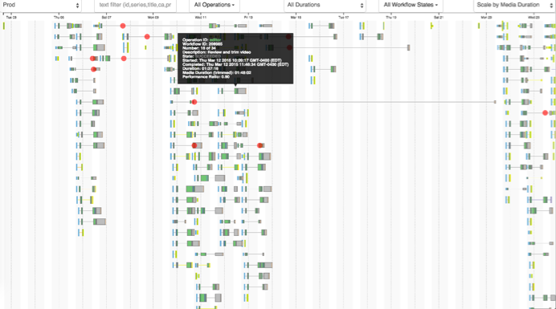

## Synopsis

The Matterhorn Workflow Browser (WFB) is an interactive d3-based
javascript visualization optimized for relatively small chunks (a few
hundred) of [Opencast Matterhorn](http://opencast.org/matterhorn/)
"workflow instances." Users may zoom, pan, and filter by a variety of
criteria. Mouse over an element for more information, click on an
element to link back to the corresponding page in the Matterhorn admin
UI. Its purpose is to give a raw but accessible overview of the last
week or so of Matterhorn workflow activity.



A "workflow instance" (set of videos and metadata passing through the
system) is represented as series of operations (fat boxes) linked
together by a thin line. Operations are color coded by type
("compose", "archive," etc.). Due to current limitations of the MH
workflow api, some operations are missing start or stop times
("capture" and "ingest").

The browser accepts Matterhorn workflow endpoint json as input,
samples of which may be found in the app data directory. Note that the
WFB is a client-side only widget, so the endpoint json will have to be
retrieved by an intermediate process that handles authentication,
either via a simple cronjob to generate flat files (the way we are
currently using it, using
[pyhorn](https://github.com/harvard-dce/pyhorn) to fetch the last 300
workflows every 10 minutes), or by embedding it in a dynamic webapp
(as we plan to).

Because the Matterhorn workflow api does not currently return media
info for all workflow instance (duration is of particular interest),
our intermediate process "enriches" the raw workflow json by creating
additional api queries for this data when it is missing and stuffing
it in the main workflow json consumed by the WFB.

The WFB is pre-alpha software very much tailored to our specific
concerns here at Harvard DCE, but we're releasing it in the hope that
it might be useful to others as a starting point for their own visual
exporations of workflow data.

## Build and run on sample data

Make sure you have installed npm, bower, and grunt.

Then clone this repo.

cd into the root directory

npm install

bower update

grunt 

grunt serve

This should open a web browser pointed at the WFB on some sample data.

To deploy, plop the contents of the generated dist directory on your
webserver, diddle with the configuration in index.html as described
below, and point it at some real data.

At some point (very!) soon I will figure out how to distribute the WFB
via bower.

## Configuration

The "workflowBrowser" function creates and instance of the WFB and
inserts it into the specified "target" div and desired height and
width. Feed it an array of "dataSources", each with "name", workfow
json "dataUrl" to load, and "host" to hyperlink back to when elements
are clicked.

```
      wfb = workflowBrowser({
      dataSource: 'Prod',
      dataSources: [ 
      {'name': 'Dev',   'host': 'http://dev.admin.mh.uni.edu',   'dataUrl':'data/dev_dump.json'   },
      {'name': 'Stage', 'host': 'http://stage.admin.mh.uni.edu', 'dataUrl':'data/stage_dump.json' },
      {'name': 'Prod',  'host': 'http://prod.admin.mh.uni.edu',  'dataUrl':'data/prod_dump.json'  }
      ],
      width: window.innerWidth,
      height: window.innerHeight,
      target: '#wfb'
      });

```      

If you want the WFB to resize dynamically with the window, add something like the following:

```
      $( window ).resize(function() {
      wfb.size(window.innerWidth,window.innerHeight);
      });
```

See the sample index.html file for a working example.

## Contributors

* Reinhard Engels - [brainheart](https://github.com/brainheart)

## License

mh-workflowbrowser is licensed under the Apache 2.0 license

## Copyright

2015 President and Fellows of Harvard College


